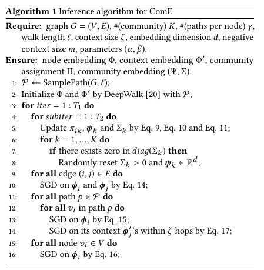

# Learning Community Embedding with Community Detection and Node Embedding on Graphs - Cavallari et al. 

## Goals

- Guided by the closed loop insight, we propose ComE, a novel Community Embedding framework that **jointly solves community embedding, community detection and node embedding together**.
- Propose: a scalable inference algorithm which complexity of O(|V | + |E|), is often lower than the existing higher-order proximity-aware methods

## Preliminaries

- Graph $G = (V, E)$

## Challenges

- Community: Is a group of densely connected nodes
  - Embedding is expected to characterize how its member nodes distribute in the low-dimensional space
  - Define it as a distribution
- Pipeline approach is suboptimal:
  - Because its community detection is independent of its node embedding. 
- Most existing node embeddings are not aware of community structure

## Previous Work / Citations

- Don’t try to directly detect communities
- Often: don't jointly optimize node embedding and community detection together
- SEA: 
  - Construct similarity matrix from spectral GCN embeddings
  - Input it into AE for reconstruction
  - Resulting node embeddings are fed in K-means clustering
  - Shown to perform better than spectral clustering
- M-NMF:
  - Constructs modularity matrix and applies non-negative matrix factorization to learn node embeddings ans community detection together
  - Represents each community as a vector! 
- **This Work:** 
  - Motivated by Gaussian Mixture Models (GMM)
  - Tries to directly detect communities

## Definitions

$$
\begin{array}{c|l}
\hline \text { Notation } & \text { Description } \\
\hline G(V, E) & \text { Graph } G, \text { nodes } V \text { and edges } E \\
\hline \ell & \text { Length of each random walk path in sampling } \\
\hline \gamma & \text { Number of random walks for each node in sampling } \\
\hline \zeta & \text { Context size } \\
\hline m & \text { Negative context size } \\
\hline \boldsymbol{\phi}_{i} \in \mathbb{R}^{d} & \text { Node embedding of node } i \\
\hline \boldsymbol{\phi}_{i}^{\prime} \in \mathbb{R}^{d} & \text { Context embedding of node } i \\
\hline \mathcal{N}\left(\psi_{k}, \Sigma_{k}\right) & \text { Community embedding of community } k \\
\hline \psi_{k} \in \mathbb{R}^{d} & \text { Community embedding } k \text { 's mean vector } \\
\hline \Sigma_{k} \in \mathbb{R}^{d \times d} & \text { Community embedding } k \text { 's covariance matrix } \\
\hline \pi_{i k} \in[0,1] & \text { Community membership of node } i \text { to community } k \\
\hline P_{n}(\cdot) & \text { Negative sampling probability } \\
\hline K & \text { Number of communities on } G \\
\hline \alpha & \text { Trade-off parameter for context embedding } \\
\hline \beta & \text { Trade-off parameter for community embedding } \\
\hline a & \text { graph's average degree } \\
\hline
\end{array}
$$

* **Community detection**: aims to discover groups of nodes on a graph,
  such that the intra-group connections are denser than the intergroup ones
  * Desired output:
    * Node embedding $\Phi_i \quad \forall v_i \in V$
    * Community membership: $\pi_{ik} \quad \forall v_i \in V$
    * Community embeddings: $(\Psi_k, \Sigma_k)$
* **Community embedding**: of community $k$ in $d$-dimensional space
  * is Multivariate Gaussian distribution: $\mathcal{N}(\Psi_k, \Sigma_k)$

## Outline / Structure

- Community Detection:
  - Considering $v_i$ and embeddings $\phi_i$ as generated by multivariate Gaussian distribution from a community $z_i = k$, then for all nodes $v$ we have likelihood:
    * $\prod_{i=1}^{|V|} \sum_{k=1}^{K} p\left(z_{i}=k\right) p\left(v_{i} \mid z_{i}=k ; \boldsymbol{\phi}_{i}, \psi_{k}, \Sigma_{k}\right)$ (eq 1) where
      * $p(z_i = k)$: probability of node $v_i$ belonging to community $k$ ($\pi_{ik}$)
    * Rewritten: $p\left(v_{i} \mid z_{i}=k ; \phi_{i}, \psi_{k}, \Sigma_{k}\right)=\mathcal{N}\left(\phi_{i} \mid \psi_{k}, \Sigma_{k}\right)$ where
      * $(\Psi_k, \Sigma_k)$ are unknown (optimization target)
    * Optimizing achieves both community detection and embedding
- **Node embedding**:
  - **First Order Proximity**: Optimizing for direct distance of two nodes
    * $O_{1}=-\sum_{\left(v_{i}, v_{j}\right) \in E} \log \sigma\left(\boldsymbol{\phi}_{j}^{T} \boldsymbol{\phi}_{i}\right)$
  - **Second Order Proximity**: Two nodes sharing many contexts should have similar embedding
    * Usually through negative sampling
      * $\Delta_{i j}=\log \sigma\left(\boldsymbol{\phi}_{j}^{\prime T} \boldsymbol{\phi}_{i}\right)+\sum_{t=1}^{m} \mathbb{E}_{v_{l} \sim P_{n}\left(v_{l}\right)}\left[\log \sigma\left(-\boldsymbol{\phi}_{l}^{\prime T} \boldsymbol{\phi}_{i}\right)\right]$
- **Higher-order proximity**: (defined for community detection / embeddings task)
  - two nodes sharing a community are likely to have similar embedding
  - $O_{3}=-\frac{\beta}{K} \sum_{i=1}^{|V|} \log \sum_{k=1}^{K} \pi_{i k} \mathcal{N}\left(\phi_{i} \mid \psi_{k}, \Sigma_{k}\right)$
- To close the loop the objective is unified:
  - First, second and higher order proximity should be minimized
    - $\mathcal{L}\left(\Phi, \Phi^{\prime}, \Pi, \Psi, \Sigma\right)=O_{1}(\Phi)+O_{2}\left(\Phi, \Phi^{\prime}\right)+O_{3}(\Phi, \Pi, \Psi, \Sigma)$
  - Optimization target:
    - $\left(\Phi^{*}, \Phi^{\prime z}, \Pi^{*}, \Psi^{*}, \Sigma^{*}\right) \leftarrow \underset{\forall k, \operatorname{diag}\left(\Sigma_{k}\right)>0}{\arg \min } \mathcal{L}\left(\Phi, \Phi^{\prime}, \Pi, \Psi, \Sigma\right)$
    - Note that Gaussian component can collapse making diag become zero and $0_3$ negative infinity
- Inference:
  - Two parts:
    - Iteratively optimizing $(\Pi, \Psi, \Sigma)$ with a constrained minimization given $(\Phi, \Phi')$
      - Constaints: $diag(\Sigma_k) > 0 \quad \forall k \in K$
      - Expectation Maximization algorithm (iteratively update params)
    - Optimizing $(\Phi, \Phi')$ with an unconstrained minimization given $(\Pi, \Psi, \Sigma)$.
  - Initialize  $(\Phi, \Phi')$ with deepwalk results
    - Optimize $\mathcal{L}\left(\Phi, \Phi^{\prime}, \Pi, \Psi, \Sigma\right)$ using SGD

## Evaluation

- average degree can impact performance due to length and the window size limitation of random walks

## Discussion

* The part / constraint enforcement for zero checking $diag(\Sigma_k)$ is not really that convincing

## Code

- https://github.com/vwz/ComE

## Resources

- ...

## Notes

* What is a modularity matrix?