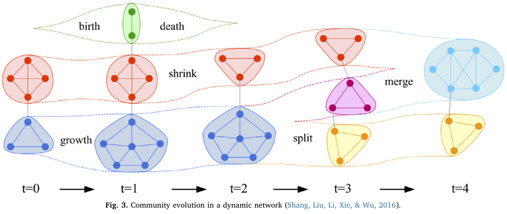

# Tracking community evolution in social networks: A survey - Dakiche et al. 

## Goals

- Presents a survey of previous studies done on the problem of tracking community evolution over time in dynamic social networks.
- To classify existing methods dealing with the issue:
  - based on independent successive static detection and matching
  - based on dependent successive static detection
  - based on simultaneous study of all stages of community evolution
  - based on methods working directly on temporal networks

## Definitions

- Communities in real world networks are of different kinds: 
  - **disjoint or non-overlapping** (students belonging to different disciplines in an institute)
  - **overlapping** (person having membership in different social groups on Facebook)
  - **hierarchical** (cells in human body form tissues that in turn form organs and so on)
- Dynamic communities can change or evolve over time
  - Depend on underlying networks evolving over time
    - Time-series of static networks called **timeframes (snapshots)**
    - Real time a stream of edges (**temporal networks**)
  - Tracking dynamic communities is the same when using both representations since a **sequence of snapshots can be turned into a temporal network** and vice versa
- Evolution of a particular community can be defined in two different ways:
  - Evolution is described by **identified community transformations** from one snapshot to another
  - **Initial static community and a sequence of modifications** on this community, namely, nodes integration and nodes exclusion
- Changes of dynamic communities:
  - Different operations that define a dynamic network are node and edge appearance and node and edge disappearance
  - **Operations that define community changes** are more complex and are called “events”
    - Birth, when a new community emerges at a given time.
    - Death, when a community disappears. All nodes belonging to this community lose their membership.
    - Growth, when a community acquires some new members (nodes).
    - Contraction, when a community loses some of its members.
    - Merging, when several communities merge to form a new community.
    - Splitting, when a community is divided into several new ones.

* **Dynamic community detection**: consists in finding series of similar communities in different time snapshots
  * Absence of a unique definition of community is one of the main issues of the community detection problem
  * Evaluation:
    * In order to **evaluate** community detection methods, **synthetic generators are used to produce network data** (benchmarks)
      * RDyn generates dynamic network topologies as well as temporally evolving ground-truth communities
    * **Common way for the evaluation** is to compute the **Normalized Mutual Information score (NMI)**
    * Without previously knowing the ground-truth communities use a community **quality score**
      * **Modularity** (Newman, 2004; Newman & Girvan, 2004)
      * Conductance, Expansion …
    * Quality function to evaluate algorithms **favors the ones that are designed to optimize it**
    * 

## Challenges

- Absence of a unique definition of community
- Quality function to evaluate algorithms **favors the ones that are designed to optimize it**
- 

## Previous Work / Citations

Approaches for tracking dynamic community evolution

### **Independent Community Detection and Matching**: 

**First detect communities** at each time step and **then match** them across different time-steps

* Unmodified traditional community detection methods can be reused
* Parallelism can be used for community detection.
* Major drawback: Community detection algorithms are unstable.

#### Works

- CommTracker in which important nodes of communities are determined based on their centrality values in the network, and the mapping of communities is performed based on the common core nodes (**tracking community core evolution**)
- **Greene et al. (2010)**:  
  - Using the static algorithm MOSES to detect the communities on each snapshot.
  - Then, they described a **weighted bipartite matching to map communities** and then **characterized each community by a series of events**
- **Tajeuna, Bouguessa, and Wang (2015)**: 
  - Model comprises a **new similarity measure**, named **mutual transition**, for tracking the communities and
    rules to capture significant transition events a community can undergo
- **Sun, Tang, Pan, and Li (2015)**:
  - Applied the Louvain algorithm to find the communities.
  - Then **built a correlation matrix** to describe the relationship between communities in time step t and t + 1

### **Dependent Community Detection**: 

Detect communities at time $t$ and then **use them to detect communities at time $t+1$**,  thus introducing smoothness in the community identification process

* Reduce computational cost by reusing much of the previous community
* Traditional community detection methods are no longer directly applicable
* Does not allow parallelism in community detection
* Generally, there are two basic ideas:
  * **Basic algorithms** such as the Louvain algorithm
  * Methods that use a **cost-function with the purpose of minimizing the communities’ changes** in successive time
    steps

#### Works

* **He and Chen (2015)**: 
  * **Improved the Louvain algorithm** by including the concept of dynamism when forming communities
* **Chakrabarti et al. (2006)**: 
  * Introduce the **evolutionary clustering method**
  * Used two optimization parameters: snapshot quality to measure the clustering quality on the current time step, and history quality to compute the similarity between the current clustering
* **Yang, Chi, Zhu, Gong, and Jin (2011)**:
  * Time-varying stochastic block model for finding communities
  * They assumed a **transition probability matrix** which **governs all the community assignments of nodes** for all time step
  * Cannot represent complicated time variations such as split and merge of communities
* **Kim and Han (2009)**:
  * Built on the assumption that a network is made of a number of **particles called nano-communities**
  * Used an information theory-based mapping technique to recognize the stages of the community
* **Gao, Luo, and Bu (2016)**:
  * Evolutionary community discovery algorithm based on **leader nodes**
  * Each **community is considered as a set of follower nodes** congregating close to a potential leader
  * Algorithm consisted of an updating strategy incorporated with temporal information to get the initial
    leader nodes
  * Keeping the **temporal smoothness of leader nodes**

### **Simultaneous Community Detection on All Snapshots**:  

First **construct a single graph** by adding edges between instances of nodes in different time-steps,  and then run a classic community detection. All considered at the same time in order to discover coherent communities

* **Main advantage**: is providing a solution for the lack of stability of the independent community detection
* Difficulty to detect complex operations such as merging and splitting

###  **Dynamic Community Detection on Temporal Networks**: 

Update the ones previously found according to network modifications. Known as **online approach**, covers methods working directly on temporal networks.  Algorithms falling into this category **process iteratively**.

* Since the communities evolve naturally through modifications, there is, **no longer, an instability problem**
* Advantage: low complexity of tracking communities, since changes can be incremental
* Problem: Modifications are done at a **local level**, they can **involve drifting towards invalid communities**

#### Works

* **Li, Huang, Bai, Wang, and Chen (2012)**:
  * Used the evolution of the network edge by edge
  * According to the modifications made within the network **concerned nodes will be able to change communities**
*  **Shang et al. (2012)**: 
  * Method consists in adding (or removing) each new edge as it appears (or disappears), and to **locally modify the concerned communities** in a way to increase the modularity
* **Nguyen, Dinh, Xuan, and Thai (2011b)**:  
  * each node as an autonomous agent demonstrating flocking behavior toward their preferable neighboring groups
* **Xu, Wang, and Xiao (2013)**: 
  *  Analyse the evolution of community cores
  * Tracks only stable links within face to face interaction graphs based on a Label Propagation algorithm
* **Bhat and Abulaish (2015)**:
  * HOCTracker, for tracking the evolution of hierarchical and overlapping communities in online social networks
  * Using a novel **density-based method** for **detecting overlapping community structures**
* **Held and Kruse (2016)**: 
  * Based on the assumption that there exist some highly connected nodes, called hubs, which will group people around them.

## Evaluation

- ...

## Code

- ...

## Resources

- ...